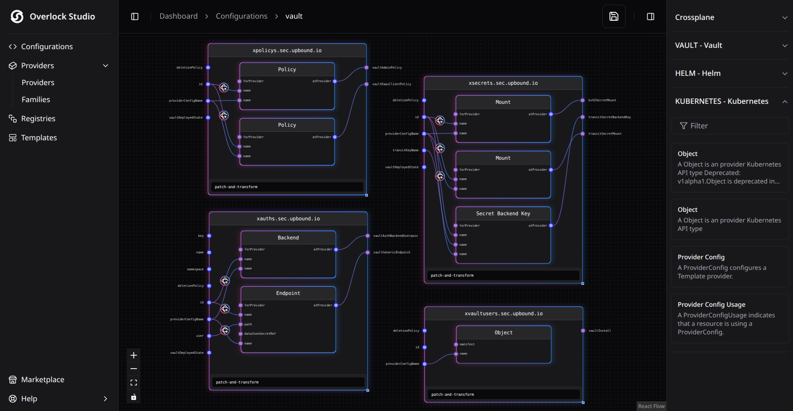

# Overlock Studio

Visual platform for building and managing Crossplane resource.

Overlock Studio allows platform engineers to design Crossplane
Compositions and XRDs visually, connect resources, and package
infrastructure as reusable modules.

## Key Features

- Visual Crossplane Composition editor
- Resource dependency graph
- XRD generation
- Package import/export
- Crossplane package repository support

---

## Why Overlock Studio?

Writing Crossplane compositions manually can be complex and difficult to maintain.

Overlock Studio provides a visual interface that allows platform engineers
to design infrastructure architectures faster and with fewer errors.
